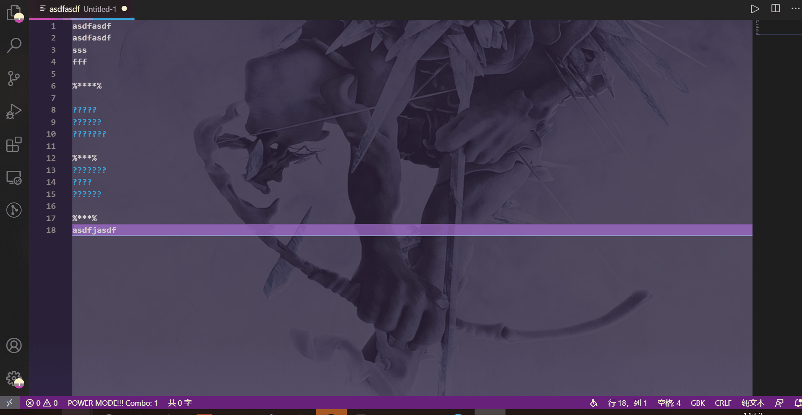

# code-block README

This is an extension which provide the functionality of splitting the code file into small blocks and manipulate with it (something like Jupyter).

"ctrl+shift+p" and execute the command "Change State" to enable the extension.

## Features

- Splitting the code file into blocks with regular expression. By now I use the MATLAB comment "%**%"

- Highlighting the current block (where the cursor point to). If you don't need this function, you can disable/enable it by pressing "alt+d". The status bar will show the current state.

- Quickly navigate through blocks. If the current state is "code blocks enabled", when you press "ctrl+upArrow"/"ctrl+downArray", the cursor will go to the previous or next block.

  

  **If you cannot see the demo gif here, then go to the Github Repository and read the README** .

  

- The above two functionality are optional enabled. The following is always enabled: Select the whole current block. Pressing the "alt+s" will select the whole current block.

## Extension Settings

I'll release the settings soon. Including the  delimiter regular expression, highlight color and so on.

## Known Issues

When designing the extension, I only consider the situations in which the first line in the editor (file) isn't be the delimiter.

## Release Notes

### 0.0.1

